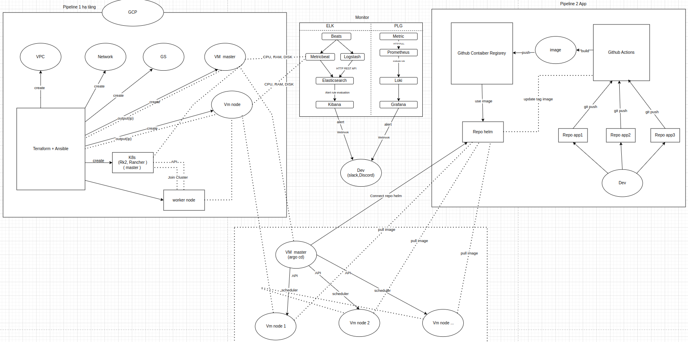

# 🚀 RKE2 on GCP – Hạ tầng IaC & GitOps

  

  <b>Terraform · Ansible · RKE2 · ArgoCD · GitOps</b>

---

## 1. Mục tiêu dự án

Dự án này xây dựng một hệ thống **triển khai hạ tầng và Kubernetes tự động**
trên **Google Cloud Platform (GCP)** bằng cách áp dụng:

- **Infrastructure as Code**: Terraform
- **Configuration Management**: Ansible
- **Kubernetes**: RKE2
- **GitOps**: ArgoCD

Mục tiêu chính:
- Tự động tạo hạ tầng cloud
- Tự động cài đặt Kubernetes cluster
- Chuẩn bị nền tảng cho CI/CD và triển khai ứng dụng theo GitOps
- Làm cơ sở để mở rộng **multi-app** và **scale cluster** sau này

---

## 2. Tổng quan kiến trúc

Hệ thống được chia thành **2 pipeline chính**:

### Pipeline 1 – Hạ tầng & Kubernetes
- Terraform tạo hạ tầng trên GCP
- Ansible cài đặt và cấu hình Kubernetes (RKE2)
- ArgoCD được cài trực tiếp trong cluster

### Pipeline 2 – Ứng dụng (GitOps)
- Dev build image bằng GitHub Actions
- Image được lưu ở Container Registry
- ArgoCD pull Helm chart và deploy ứng dụng lên cluster

---

## 3. Pipeline 1 – Hạ tầng (Terraform + Ansible)

### 3.1 Terraform – Tạo hạ tầng GCP

Terraform hiện đang làm các việc sau:
- Tạo VPC và Subnet
- Cấu hình firewall cơ bản
- Tạo VM:
  - 1 VM master (RKE2 server)
  - 1 VM worker (RKE2 agent)
- Inject SSH key
- Xuất public IP và private IP
- Sinh file inventory cho Ansible từ template

Terraform **chỉ chịu trách nhiệm hạ tầng**, không cài phần mềm.

---

### 3.2 Ansible – Cài Kubernetes & ArgoCD

Ansible đảm nhiệm:
- Cài RKE2 server trên node master
- Lấy token join cluster
- Cài RKE2 agent trên node worker
- Join worker vào cluster
- Cấu hình kubeconfig cho user
- Cài ArgoCD vào namespace `argocd`

Toàn bộ quá trình được orchestration bằng script:

    ./deploy.sh

---

## 4. Pipeline 2 – Triển khai ứng dụng (GitOps)

Pipeline ứng dụng được thiết kế theo GitOps:

- Dev push code lên Git repository
- CI build Docker image
- Image được push lên container registry
- Repo Helm lưu cấu hình deploy
- ArgoCD:
  - Theo dõi repo Helm
  - Tự động sync
  - Deploy app lên Kubernetes worker node

---

## 5. Cách ArgoCD sync ứng dụng (thực tế đã làm)

Sau khi Pipeline 1 chạy thành công, hệ thống đã có:
- Kubernetes cluster hoạt động
- ArgoCD được cài trong cluster

### 5.1 Kết nối ArgoCD với Helm Repository

Các bước thực hiện:
- Truy cập ArgoCD UI
- Add repository chứa Helm chart
- Xác thực bằng GitHub Personal Access Token (PAT)
  (do repo là private)

PAT cho phép ArgoCD:
- Clone repo Helm
- Theo dõi thay đổi trong Git
- Sync ứng dụng tự động

---

### 5.2 Tạo Application trong ArgoCD

Trong ArgoCD:
- Khai báo:
  - Repo URL (Helm repo)
  - Path đến Helm chart
  - Target cluster (in-cluster)
  - Namespace deploy
- Bật Auto Sync

Khi Auto Sync được bật:
- Mỗi lần repo Helm thay đổi
- ArgoCD tự động reconcile trạng thái cluster

---

### 5.3 Luồng sync GitOps hoàn chỉnh

Luồng triển khai ứng dụng:

- CI build image → push image mới
- CI update values.yaml (tag image)
- Commit & push repo Helm
- ArgoCD phát hiện thay đổi
- ArgoCD auto sync
- Kubernetes deploy / update application

Không cần dùng kubectl apply thủ công.

---

## 6. Cấu trúc project hiện tại

    .
    ├── ansible
    │   ├── ansible.cfg
    │   ├── install-rke2-server.yaml
    │   ├── install-rke2-agent.yaml
    │   ├── install-argocd.yaml
    │   ├── inventory.tpl
    │   ├── inventory.ini
    │   └── site.yaml
    ├── terraform
    │   ├── main.tf
    │   ├── providers.tf
    │   ├── variables.tf
    │   ├── outputs.tf
    │   └── modules
    │       ├── network
    │       └── vm
    ├── deploy.sh
    ├── docs
    │   └── image.png
    └── README.md

---

## 7. Những vấn đề hiện tại

Hệ thống hoạt động được nhưng còn các hạn chế:

- Chưa scale node linh hoạt (số worker cố định)
- Chưa quản lý multi-app chuẩn
- Chưa kiểm soát ứng dụng chạy trên node nào
- Chưa có UI quản lý cluster
- Cluster chỉ có 1 master (chưa HA)
- Monitoring (ELK, Prometheus, Grafana) mới ở mức sơ đồ

---

## 8. Hướng phát triển & cách giải quyết

### 8.1 Multi-app (nhiều ứng dụng)

Cách làm:
- Mỗi ứng dụng là một Helm chart
- Repo Helm có cấu trúc:

    helm-repo/
    ├── app1/
    │   ├── Chart.yaml
    │   ├── values.yaml
    │   └── templates/
    ├── app2/
    └── app3/

Trong values.yaml:
- Quản lý image (repository, tag)
- CI chỉ cần update tag
- ArgoCD tự động sync

---

### 8.2 Phân bổ app lên node worker

Label node:

    kubectl label node worker-1 role=backend

Trong Helm:

    nodeSelector:
      role: backend

Hoặc dùng affinity để phân bổ nâng cao.

---

### 8.3 Scale node nhanh & quản lý cluster

Terraform:
- Dùng count / for_each để tăng giảm số VM worker

Rancher:
- Import RKE2 cluster
- Quản lý node bằng UI
- Thêm / xoá worker nhanh
- Phục vụ vận hành (day-2 operations)

---

## 9. Kết luận

Dự án đã:
- Tự động hoá hạ tầng
- Tự động cài Kubernetes
- Triển khai GitOps
